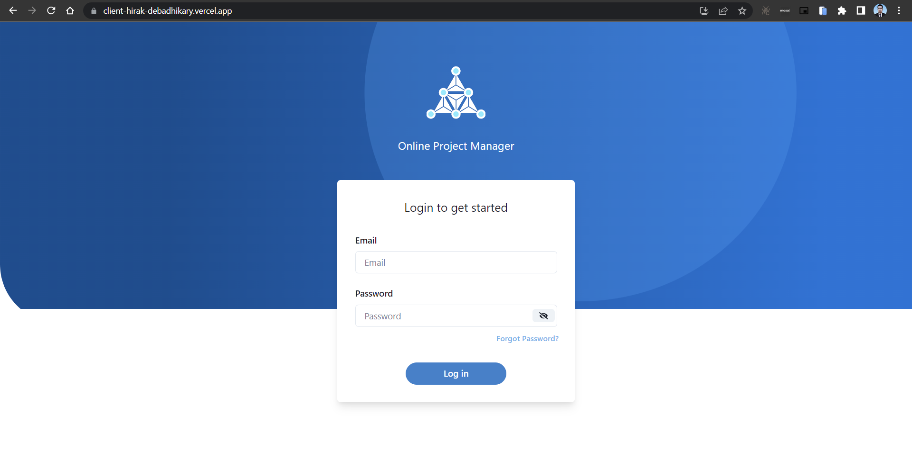
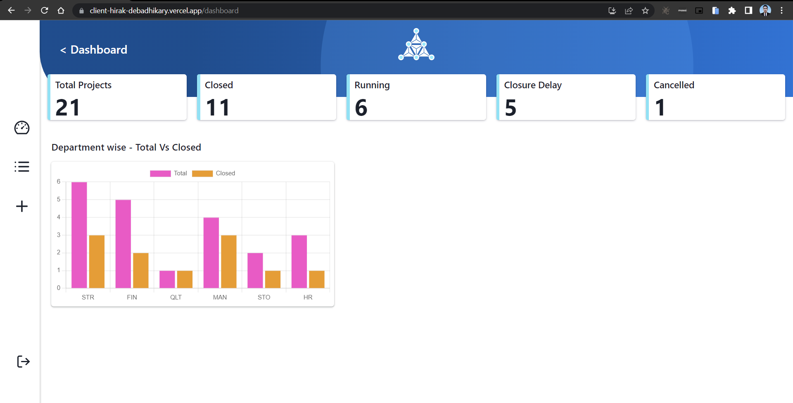
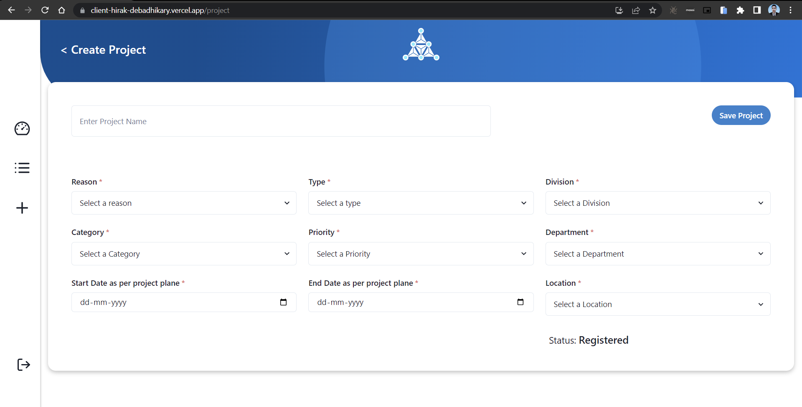
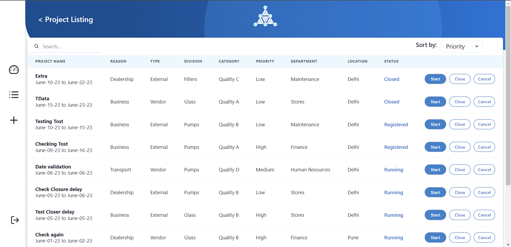
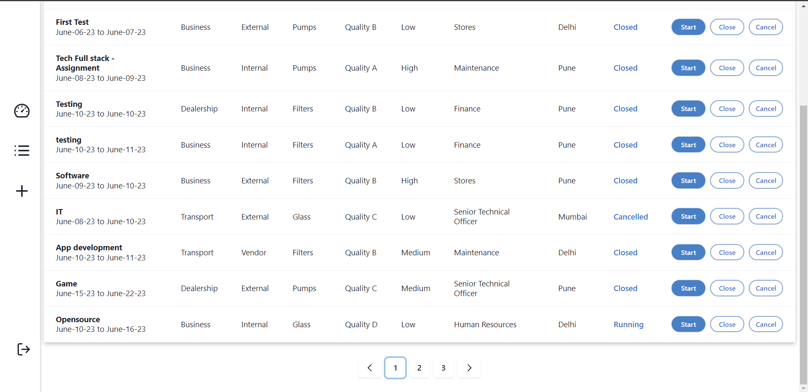

# Techprimelab-Assignment       
       
# Full-Stack-Aplication - 
Welcome to the project repository for Full-Stack-Application. This project aims to provide a comprehensive web application for managing projects and their associated data. The application offers various features and functionalities, outlined below:

# Tech Stack - 
   # Front end - React.js and Chakra-Ui

   # Backend - Node.js, Express.js

   # Database - MongoDB.

# Features - 
# 1. Login Page -
The login page allows users to securely authenticate themselves and gain access to the system. Users can enter below credentials and log in to the application.
Email - hirak@gmail.com
Password - 0000

# 2. Dashboard Page -
The dashboard page provides users with an overview of project-related information. It displays counts related to project statuses, enabling users to track the progress and status of their projects. Additionally, a chart is presented to visually represent the project data, enhancing the understanding of key metrics and trends.

# 3. Create Project Page -
The create project page empowers users to add new projects to the system. Users can input relevant details and submit the form to create a new project entry. This functionality facilitates efficient project management and organization.

# 4. Project Listing Page -
The project listing page showcases all the projects that have been added to the system. It offers comprehensive details for each project, allowing users to quickly access relevant information. Additionally, the page includes pagination functionality, limiting the display to 10 projects per page to improve readability. Users can also utilize the searching and sorting features to efficiently find specific projects based on their requirements.

# Pagination - 

# Mobile Simulator Extinction - Huawei P30 PRO (360*780)
This simulator helps replicate the screen size of the Huawei P30 PRO with a resolution of 360 pixels width and 780 pixels height. It allows you to test your mobile applications or websites for this specific device.

# Installation -
To set up the project locally, follow these steps:- 
 Clone the repository to your local machine.
Install all the required dependencies using the package manager of your choice.
Configure the database connection and ensure it is properly set up.
Run the application and navigate to the designated port to access it in your web browser.

